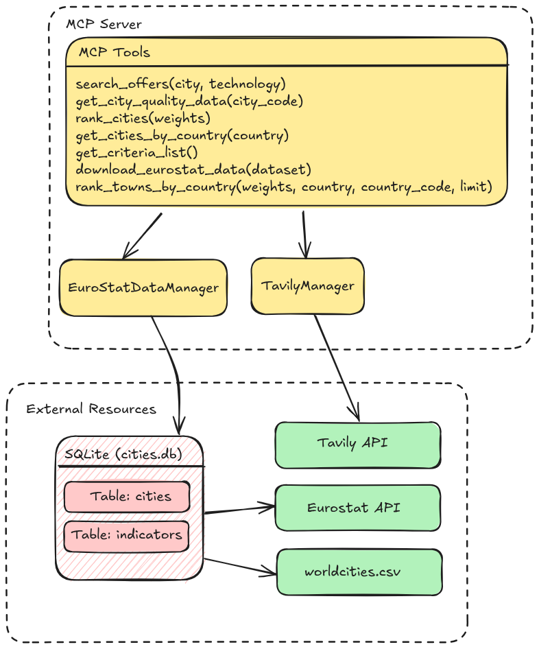
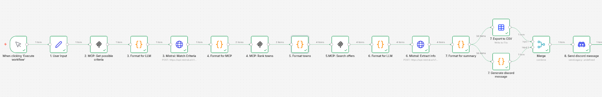

# Project Report: AI-Powered Internship Scout & European City Quality of Life MCP Server

## 1. Executive Summary

This project automates the search for an international internship by cross-referencing real-time job availability with official quality-of-life (QoL) metrics. By bridging the gap between employment opportunities and living standards, the system allows users to find roles in cities that align with their personal values.

## 2. System Architecture

The system utilizes a containerized architecture managed via Docker, ensuring a consistent environment for the Model MCP server and the n8n automation engine.

* **MCP Server**: A custom Python application built with `FastAPI` (exposed via `FastMCP`) that serves as the
* **n8n**: Orchestrates the logic flow, LLM prompting, and final delivery.
* **External APIs**:
    * **Eurostat**: Official European statistical data for city-level indicators (https://ec.europa.eu/eurostat/web/cities/database).
    * **Tavily API**: An AI-optimized search engine used to scrape real-time internship listings.
    * **SimpleMaps**: Provides the geographic backbone (lat/long and population) for city data (https://simplemaps.com/data/world-cities).


## 3. MCP Server Logic & Data Management



### 3.1 Eurostat Data Manager

The `EurostatDataManager` class is responsible for the lifecycle of city data, from ingestion to ranking.

#### Ranking Methodology

The system calculates a weighted normalized score for each city. Two critical logic layers ensure the ranking is accurate:

1. **Polarity Correction**: To ensure a high score always represents "better" quality, the system identifies "negative" indicators (e.g., crime, pollution, or long commute times). For these, the normalized value is inverted.

2. **Normalization**: Values are scaled according to their unit types (percentages, minutes, or currency) to allow for a fair comparison between disparate metrics like "Average Rent" and "Air Quality."

3. **Fallback Logic**: Recognizing that data for smaller municipalities can be sparse, the server implements a recursive fallback. If no statistical indicators are available for a requested city, it defaults to a population-based ranking to ensure the user still receives valid geographic suggestions.

### 3.2 Tavily API Manager

The `TavilyManager` serves as the bridge to the live web. Unlike standard search engines, Tavily is optimized for LLM context, returning clean, high-relevance content.

## 4. Workflow Implementation


The [n8n workflow](workflow.json) follows an 8-stage pipeline to transform a user's vague preferences into a structured report:


1. **User Input Capture**: Collects target technologies, countries of interest, and QoL preferences.


2. **Schema Alignment**: Retrieves valid Eurostat criteria via `get_criteria_list()`.


3. **LLM Mapping**: Translates natural language (e.g., "I hate traffic") into database-friendly codes.


4. **Multi-City Ranking**: Identifies the top 2 cities per country that match the weighted criteria.


5. **Targeted Web Scraping**: Calls `search_offers()` for each identified city.


6. **Information Extraction**: An LLM parses raw HTML/text into a structured schema: `Company`, `Position`, `Skills`, `Summary`, `Location`, and `URL`.


7. **Data Consolidation**: Aggregates the top 10 offers into a CSV and a Discord-ready summary.


8. **Final Delivery**: Disseminates the findings via Discord webhook.





## 5. Setup and Installation


To get this project up and running, follow these steps:


### Prerequisites


*   **Python 3.12**

*   **Docker & Docker Compose**deployment.

*   **uv**


### 5.1. Clone the Repository


First, clone the project repository to your local machine:


```bash
git clone git@github.com:c-r-lewis/n8n-international-internship-scout.git
```


### 5.2. Environment Configuration


Create a `.env` file in the root of the project directory. This file will hold your environment variables, including API keys.


```
TAVILY_API_KEY="your_tavily_api_key_here"
POSTGRES_PASSWORD="your_n8n_postgres_password_here"
```


**Note**: Obtain your Tavily API key from the [Tavily website](https://tavily.com/).


### 5.3. Install Dependencies


Using `uv`, install the project dependencies:


```bash
uv sync
```


### 5.4. Prepare Data


The application relies on Eurostat data and a world cities dataset.


*   **Eurostat Data**: The `eurostat_data_manager.py` script is responsible for populating the `eurostat_data/cities.db` SQLite database. To ingest the data, you can use `mcp inspector` and call the `download_eurostat_data` function.

*   **World Cities Data**: Ensure `ressources/worldcities.csv` is present. This file provides base geographical information for cities.


## 6. Running the Application


You can run the application using Docker Compose for a containerized setup or directly using `uvicorn` for local development.


### 6.1. With Docker Compose (Recommended)


This method ensures all services run in isolated containers.


```bash
docker compose up --build
```


The application should then be accessible at `http://localhost:8000` (or the port defined in your `docker-compose.yml`).


### 6.2. Locally (for Development)


Ensure you have activated your Python virtual environment (if using one) and installed dependencies (`uv sync`).


```bash
uvicorn app:app --reload --host 0.0.0.0 --port 8000
```


The `--reload` flag enables auto-reloading on code changes, which is useful for development. The application will be available at `http://localhost:8000`.

### 6.3. Setting credentials for n8n workflow

To be able to run the n8n workflow in the n8n interface you will have to set a Mistral cloud API secret and a Discord Webhook secret.


## 7. Example Results


For a search conducted in the **United Kingdom** and **Switzerland** targeting **"Computer Science"** with a focus on **low crime and good transport**, the system successfully identified key roles in cities like Basel and Southampton, providing a direct [excel export](ressources/spreadsheet.xls) and an automated [Discord notification](ressources/discord-message.md) for immediate review.


## 8. Challenges & Solutions


*   **Multi-dimensional Data Parsing**: Eurostat’s JSON-STAT format is difficult to flatten. The solution involved developing a custom `_index_to_coords` mapper to navigate the nested dimension sizes and IDs programmatically.

*   **Payload Management**: Discord’s 2000-character limit posed a risk for the final summary. I implemented a "round-robin" selection logic in the final Code node to ensure the summary included a representative sample from all top towns without exceeding the character cap.
